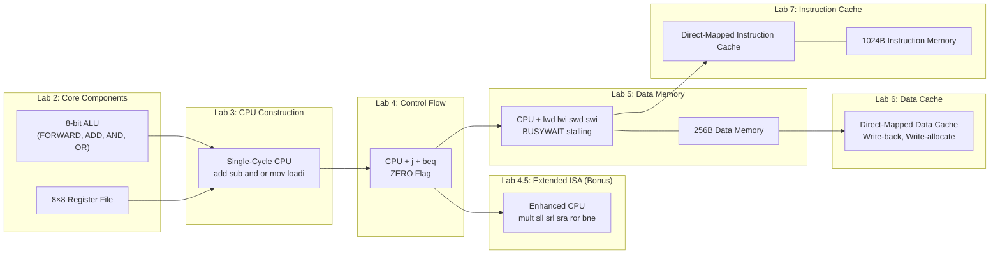
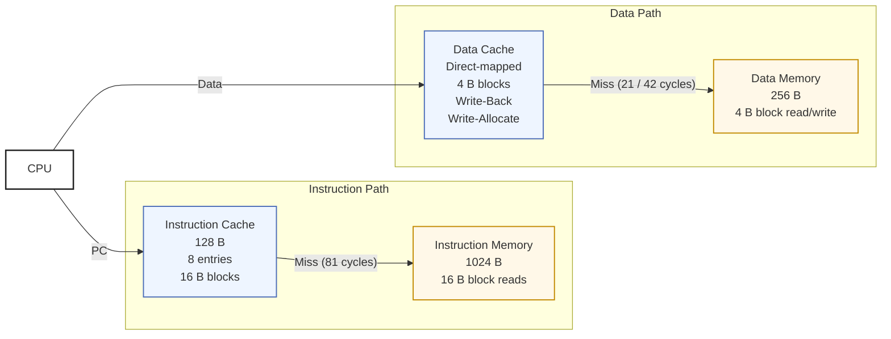

# 8-bit Single-Cycle Processor (Verilog)


An 8-bit single-cycle processor designed in Verilog HDL, featuring an ALU, 8×8 register file, control unit, program counter, data memory, data cache, instruction memory, and instruction cache. The processor implements arithmetic, logical, data transfer, jump, branch, and memory access instructions using a custom 32-bit instruction format. Developed as part of the CO2070 Computer Architecture lab series.

---

## Table of Contents

- [Project Overview](#project-overview)
- [Instruction Set Architecture](#instruction-set-architecture)
- [Development Flow](#development-flow)
- [Module Descriptions](#module-descriptions)
- [Memory Hierarchy](#memory-hierarchy)
- [Datapath & Timing](#datapath--timing)
- [Getting Started](#getting-started)
- [Extended ISA (Bonus)](#extended-isa-bonus)

---

## Project Overview

This processor implements a simplified RISC-style 8-bit ISA with 32-bit fixed-length instructions. It is a **single-cycle design**, meaning every instruction completes within one clock cycle (8 time units) under cache-hit conditions.


**Core ISA :**  `add`, `sub`, `and`, `or`, `mov`, `loadi`, `j`, `beq`

**Extended ISA :** `mult`, `sll`, `srl`, `sra`, `ror`, `bne`

**Memory accessing ISA :** `lwd`, `lwi`, `swd`, `swi`


<br>

The system uses a **two-level memory hierarchy** with separate instruction and data paths:
- Direct-mapped **data cache** (write-back, write-allocate) backed by a 256-byte data memory
- Direct-mapped **instruction cache** backed by a 1024-byte instruction memory

---

## Instruction Set Architecture


### Instruction Encoding (32-bit fixed length)

| Bits 31–24 | Bits 23–16 | Bits 15–8 | Bits 7–0 |
|------------|------------|-----------|----------|
| OP-CODE    | RD / IMM   | RT        | RS / IMM |

- **OP-CODE** (bits 31–24): identifies the operation
- **RD** (bits 23–16): destination register, or immediate (jump/branch offset)
- **RT** (bits 15–8): source register 1
- **RS / IMM** (bits 7–0): source register 2, or immediate value


### Instruction Reference

| Instruction | Example | Description |
|-------------|---------|-------------|
| `add`   | `add 4 1 2`       | R4 ← R1 + R2 |
| `sub`   | `sub 4 1 2`       | R4 ← R1 − R2 |
| `and`   | `and 4 1 2`       | R4 ← R1 & R2 |
| `or`    | `or 4 1 2`        | R4 ← R1 \| R2 |
| `mov`   | `mov 4 1`         | R4 ← R1 (bits 7–0 ignored) |
| `loadi` | `loadi 4 0xFF`    | R4 ← 0xFF (bits 15–8 ignored) |
| `j`     | `j 0x02`          | PC ← PC+4 + (offset×4), forward jump |
| `beq`   | `beq 0xFE 1 2`    | if R1 == R2: PC ← PC+4 + (offset×4) |
| `lwd`   | `lwd 4 2`         | R4 ← Mem[R2] (register direct) |
| `lwi`   | `lwi 4 0x1F`      | R4 ← Mem[0x1F] (immediate) |
| `swd`   | `swd 2 3`         | Mem[R3] ← R2 (register direct) |
| `swi`   | `swi 2 0x8C`      | Mem[0x8C] ← R2 (immediate) |

> Negative offsets (e.g. `0xFE` = −2 in signed 8-bit two's complement) enable backward branching.


---

## Development Flow
The processor was developed incrementally across a series of laboratory exercises, with each stage building upon the components implemented in previous labs.



---

## Module Descriptions

### `alu` - Arithmetic Logic Unit

**Interface:**
```verilog
module alu(DATA1, DATA2, RESULT, SELECT, ZERO);
    input  [7:0] DATA1, DATA2;
    input  [2:0] SELECT;
    output [7:0] RESULT;
    output       ZERO;   // Asserted when RESULT == 0 (used by beq/bne)
```

Each functional unit is a separate submodule with an artificial delay to model realistic latency:

| Unit | Delay | Module | Used by |
|------|-------|--------|---------|
| FORWARD | `#1` | `forward_unit` | `loadi`, `mov` |
| ADD | `#2` | `add_unit` | `add`, `sub`, memory address |
| AND | `#1` | `and_unit` | `and` |
| OR  | `#1` | `or_unit`  | `or` |


A MUX inside the `alu` module selects which unit's output to route to `RESULT` based on `SELECT`.

---

### `reg_file` - Register File

**Interface:**
```verilog
module reg_file(IN, OUT1, OUT2, INADDRESS, OUT1ADDRESS, OUT2ADDRESS, WRITE, CLK, RESET);
    input  [7:0] IN;
    input  [2:0] INADDRESS, OUT1ADDRESS, OUT2ADDRESS;
    input        WRITE, CLK, RESET;
    output [7:0] OUT1, OUT2;
```

- 8 registers × 8 bits each
- **Reads** are asynchronous with a `#2` delay
- **Writes** are synchronous (rising edge of CLK), with a `#1` delay
- **Reset** is synchronous, clears all registers to zero on positive clock edge when `RESET` is high


---

### `cpu` - Top-Level Processor

**Interface:**
```verilog
module cpu(PC, INSTRUCTION, CLK, RESET,
           READ, WRITE, ADDRESS, WRITEDATA, READDATA, BUSYWAIT);
    input  [31:0] INSTRUCTION;
    input  [7:0]  READDATA;
    input         CLK, RESET, BUSYWAIT;
    output [31:0] PC;
    output [7:0]  ADDRESS, WRITEDATA;
    output        READ, WRITE;
```


The CPU module integrates:
- ALU and register file
- Combinational control/decode logic
- PC register with synchronous update and reset
- PC+4 adder (`#1` latency)
- 2's complement unit for `sub` (`#1` latency)
- MUXes for operand selection, PC selection, and register write-back source
- Branch/jump target adder (`#2` latency, parallel to ALU)
- ZERO-flag multiplexer for `beq`
- BUSYWAIT stall logic : freezes PC and register writes while asserted

---

## Memory Hierarchy



### Cache Performance Summary

- **Cache Hit (Read/Write)**         : 0 stall cycles (`#1.9` time units).

- **Data Cache Miss (Clean Block)**  : 21 CPU cycle stall.

- **Data Cache Miss (Dirty Block)**  : 42 CPU cycle stall (includes writeback).

- **Instruction Cache Miss**         : 81 CPU cycle stall.


---

### `data_memory` - Data Memory

**Interface:**
```verilog
module data_memory(CLK, RESET, READ, WRITE, ADDRESS, WRITEDATA, READDATA, BUSYWAIT);
    input        CLK, RESET, READ, WRITE;
    input  [7:0] ADDRESS, WRITEDATA;
    output [7:0] READDATA;
    output       BUSYWAIT;
```

- 256 × 8-bit addressable storage
- Read and write latency: **5 CPU clock cycles** (`#40` time units)
- Asserts `BUSYWAIT` during any read or write operation

---

### `data_cache` - Data Cache

- *Cache size:* Configurable (direct-mapped)
- *Block size:* 4 bytes
- *Word size:* 1 byte
- *Address to memory:* 6-bit block address
- *Write policy:* Write-back
- *Replacement policy:* Write-allocate
- *Timescale:* `1ns / 100ps`

**Interface:**
```verilog
module data_cache(CLK, RESET, READ, WRITE, ADDRESS, WRITEDATA, READDATA, BUSYWAIT,
                  MEM_READ, MEM_WRITE, MEM_ADDRESS, MEM_WRITEDATA, MEM_READDATA, MEM_BUSYWAIT);
```


Hit/miss latencies:

| Event | Latency |
|---|---|
| Index lookup | `#1` |
| Tag comparison | `#0.9` |
| Data word select (read) | `#1` (parallel to tag compare) |
| Cache write (write-hit) | `#1` (after hit confirmed, at next clock edge) |
| Read miss — fetch from memory | 21 CPU cycles (clean) / 42 CPU cycles (dirty) |
| Write miss — writeback + fetch | 21 CPU cycles (clean) / 42 CPU cycles (dirty) |

The cache controller uses an FSM for miss handling. `BUSYWAIT` is de-asserted once a hit is resolved or a miss is fully handled.

---

### `instruction_memory` - Instruction Memory

**Interface:**
```verilog
module instruction_memory(CLK, READ, ADDRESS, READDATA, BUSYWAIT);
    input        CLK, READ;
    input  [5:0] ADDRESS;       // 6-bit block address
    output [127:0] READDATA;    // 16-byte block
    output       BUSYWAIT;
```

- Holds 256 × 32-bit instruction words (1024 bytes total)
- Block read latency: **80 CPU cycles** (16 bytes × 5 cycles/byte)

---

### `instruction_cache` - Instruction Cache

- *Cache size:* 128 bytes
- *Block size:* 16 bytes (4 instruction words)
- *Word size:* 4 bytes (32-bit instruction)
- *Number of cache entries:* 8
- *Placement policy:* Direct-mapped
- *Address to memory:* 6-bit block address
- *Write policy:* Read-only (no dirty bit)
- *Timescale:* `1ns / 100ps`


**Interface:**
```verilog
module instruction_cache(CLK, RESET, PC, INSTRUCTION, BUSYWAIT,
                         MEM_READ, MEM_ADDRESS, MEM_READDATA, MEM_BUSYWAIT);
```


Hit/miss latencies:

| Event | Latency |
|---|---|
| Index lookup | `#1` |
| Tag comparison | `#0.9` |
| Instruction word select | `#1` (parallel to tag compare) |
| Miss penalty | 81 CPU cycles |


---

## Datapath & Timing

One clock cycle = **8 time units**, rising edge to rising edge. All instructions complete within one cycle under cache-hit conditions.


### Component Latencies

| Component | Delay | Notes |
|---|---|---|
| PC write | `#1` | Synchronous |
| Instruction fetch (cache hit) | `#2` | Replaces testbench array in Lab 7 |
| PC+4 adder | `#1` | Parallel to fetch |
| Instruction decode | `#1` | Combinational |
| Register read | `#2` | Asynchronous |
| Register write | `#1` | Synchronous |
| 2's complement | `#1` | `sub`, `beq` only |
| ALU - FORWARD/AND/OR | `#1` | Combinational |
| ALU - ADD | `#2` | Combinational |
| Branch/jump adder | `#2` | Parallel to ALU |
| Data memory access (cache hit) | `#2` | Ideal; misses stall the CPU |


### Worst-Case Paths

   **ADD**  
  `PC(1) → IMEM(2) → DECODE(1) → RREAD(2) → ALU_ADD(2) → RWRT(1)`  
  *Total delay:* `9` *(critical path; straddles the clock edge).*

   **SUB**  
  `PC(1) → IMEM(2) → DECODE(1) → RREAD(2) → 2COMP(1) → ALU_ADD(2) → RWRT(1)`  
  *Total delay:* `10`.

**AND / OR / MOV**  
  `PC(1) → IMEM(2) → DECODE(1) → RREAD(2) → ALU(1) → RWRT(1)`  
  *Total delay:* `8`.

**LOADI**  
  `PC(1) → IMEM(2) → DECODE(1) → ALU(1) → RWRT(1)`  
  *Total delay:* `6`.

**J**  
  `PC(1) → IMEM(2) → DECODE(1) → BADDER(2) → PC_WRT(1)`  
  *Total delay:* `7`.

**BEQ**  
  `PC(1) → IMEM(2) → DECODE(1) → RREAD(2) → 2COMP(1) → ALU(2) → PC_WRT(1)`  
  *Total delay:* `10`.

**LWD**  
  `PC(1) → IMEM(2) → DECODE(1) → RREAD(2) → ALU(1) → DMEM(2) → RWRT(1)`  
  *Total delay:* `10`.

**LWI**  
  `PC(1) → IMEM(2) → DECODE(1) → ALU(1) → DMEM(2) → RWRT(1)`  
  *Total delay:* `8`.

**SWD / SWI**  
  Same as `LWD` / `LWI`, respectively, but without the final register write.

---

## Extended ISA (Bonus)

Lab 4.5 extends the processor with additional instructions while keeping the 3-bit ALUOP signal (8 functional units total). Functional units are shared where possible (e.g. shift operations).

| Instruction | Example | Description |
|---|---|---|
| `mult` | `mult 4 1 2` | R4 ← R1 × R2 |
| `sll`  | `sll 4 1 0x02` | R4 ← R1 << 2 (logical) |
| `srl`  | `srl 4 1 0x02` | R4 ← R1 >> 2 (logical) |
| `sra`  | `sra 4 1 0x02` | R4 ← R1 >> 2 (arithmetic) |
| `ror`  | `ror 4 1 0x02` | R4 ← R1 rotated right by 2 |
| `bne`  | `bne 0x02 1 2` | if R1 ≠ R2: branch forward 2 |


> **Note:** All new functional units are implemented without built-in Verilog operators (no `<<`, `>>`, `*`) as per lab requirements.


See `extended_ISA_documentation.pdf` for full encoding details, opcode assignments, timing analysis, and datapath modifications.


