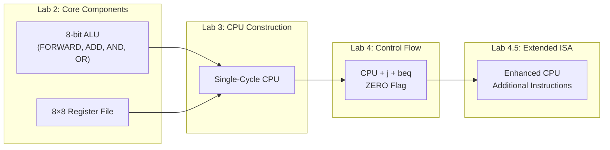

# 8-bit Single-Cycle Processor (Verilog)


An 8-bit single-cycle processor designed in Verilog HDL featuring an ALU, 8×8 register file, control unit, and program counter. The processor implements basic arithmetic, logical, data transfer, jump, and branch instructions using a custom 32-bit instruction format. Developed as part of a CO2070 Computer Architecture lab series.

---

## Table of Contents

- [Project Overview](#project-overview)
- [Instruction Set Architecture](#instruction-set-architecture)
- [Repository Structure](#development-flow)
- [Module Descriptions](#module-descriptions)
- [Datapath & Timing](#datapath--timing)
- [Getting Started](#getting-started)
- [Extended ISA (Bonus)](#extended-isa)

---

## Project Overview

This processor implements a simplified RISC-style 8-bit ISA with 32-bit fixed-length instructions. It is a **single-cycle design**, meaning every instruction completes in exactly one clock cycle (8 time units).

**Core supported instructions:** `add`, `sub`, `and`, `or`, `mov`, `loadi`, `j`, `beq`

**Extended ISA (bonus):** `mult`, `sll`, `srl`, `sra`, `ror`, `bne`

---

## Instruction Set Architecture

### Instruction Encoding (32-bit fixed length)

| Bits 31–24 | Bits 23–16 | Bits 15–8 | Bits 7–0 |
|------------|------------|-----------|----------|
| OP-CODE    | RD / IMM   | RT        | RS / IMM |

- **OP-CODE** (bits 31–24): identifies the operation
- **RD** (bits 23–16): destination register, or immediate (jump/branch offset)
- **RT** (bits 15–8): source register 1
- **RS / IMM** (bits 7–0): source register 2, or immediate value

### Instruction Reference

| Instruction | Example | Description |
|-------------|---------|-------------|
| `add` | `add 4 1 2` | R4 ← R1 + R2 |
| `sub` | `sub 4 1 2` | R4 ← R1 − R2 |
| `and` | `and 4 1 2` | R4 ← R1 & R2 |
| `or`  | `or 4 1 2`  | R4 ← R1 \| R2 |
| `mov` | `mov 4 1`   | R4 ← R1 (bits 15–8 ignored) |
| `loadi` | `loadi 4 0xFF` | R4 ← 0xFF (bits 15–8 ignored) |
| `j`   | `j 0x02`    | PC ← PC+4 + (2×4); jump forward 2 instructions |
| `beq` | `beq 0xFE 1 2` | if R1 == R2: PC ← PC+4 + (offset×4) |

> Negative offsets (e.g. `0xFE` = −2 in signed 8-bit) allow backward branching.


---

## Development Flow

The processor was developed incrementally across a series of laboratory exercises, with each stage building upon the components implemented in previous labs.



---

## Module Descriptions

### `alu` - Arithmetic Logic Unit


**Interface:**
```verilog
module alu(DATA1, DATA2, RESULT, SELECT, ZERO);
    input  [7:0] DATA1, DATA2;
    input  [2:0] SELECT;
    output [7:0] RESULT;
    output ZERO;   // 1 when RESULT == 0 (used by beq)
```


Each functional unit is a separate submodule with an artificial delay to model realistic latency:

| Unit | Delay | Module |
|------|-------|--------|
| FORWARD | `#1` | `forward_unit` |
| ADD | `#2` | `add_unit` |
| AND | `#1` | `and_unit` |
| OR  | `#1` | `or_unit`  |

A MUX inside the `alu` module selects which unit's output to route to `RESULT` based on `SELECT`.


### `reg_file` - Register File


**Interface:**
```verilog
module reg_file(IN, OUT1, OUT2, INADDRESS, OUT1ADDRESS, OUT2ADDRESS, WRITE, CLK, RESET);
    input  [7:0] IN;
    input  [2:0] INADDRESS, OUT1ADDRESS, OUT2ADDRESS;
    input        WRITE, CLK, RESET;
    output [7:0] OUT1, OUT2;
```

- 8 registers × 8 bits each
- **Reads** are asynchronous with a `#2` delay
- **Writes** are synchronous (rising edge of CLK), with a `#1` delay
- **Reset** is synchronous, clears all registers to zero on positive clock edge when `RESET` is high


### `cpu` - Top-Level Processor


**Interface:**
```verilog
module cpu(PC, INSTRUCTION, CLK, RESET);
    input  [31:0] INSTRUCTION;
    input         CLK, RESET;
    output [31:0] PC;
```

The CPU module integrates:
- ALU and register file
- Combinational control logic (instruction decode → control signals)
- PC register with synchronous update
- PC+4 incrementing adder (`#1` latency)
- 2's complement unit for `sub` (`#1` latency)
- MUXes for operand and PC selection
- (Lab 4) Branch/jump target adder (`#2` latency)
- (Lab 4) ZERO-flag-based PC selection for `beq`

Instruction memory is held in the testbench as a 1024-byte array (256 × 32-bit words) and read asynchronously by the CPU.

---

## Datapath & Timing

One clock cycle = **8 time units** (rising edge to rising edge).

### Instruction Timing Breakdown

| Stage | Latency |
|-------|---------|
| PC update (write) | `#1` |
| Instruction memory read | `#2` |
| PC+4 adder | `#1` (parallel to memory read) |
| Instruction decode | `#1` |
| Register read | `#2` |
| 2's complement (sub/beq only) | `#1` |
| ALU execute | `#1` or `#2` (depends on operation) |
| Register write | `#1` |
| Branch/jump target adder (Lab 4) | `#2` (parallel to ALU) |

### Worst-Case Paths

```
add/sub:    PC(#1) → MEM(#2) → DECODE(#1) → RREAD(#2) → [2COMP(#1)] → ALU(#2) → RWRT(#1) = 8 units
and/or/mov: PC(#1) → MEM(#2) → DECODE(#1) → RREAD(#2) → ALU(#1) → RWRT(#1) = 8 units
loadi:      PC(#1) → MEM(#2) → DECODE(#1) → ALU(#1) → RWRT(#1) = 6 units (fits within 8)
j:          PC(#1) → MEM(#2) → DECODE(#1) → BRANCH_ADDER(#2) → PC_WRT(#1) = 7 units
beq:        PC(#1) → MEM(#2) → DECODE(#1) → RREAD(#2) → 2COMP(#1) → ALU(#2) → PC_WRT(#1) = 8 units
```

---

## Getting Started

### Prerequisites

- [Icarus Verilog](http://iverilog.icarus.com/) (`iverilog` + `vvp`) — open-source Verilog simulator
- [GTKWave](http://gtkwave.sourceforge.net/) — waveform viewer
- (Optional) CO224Assembler tool provided with the lab for generating machine code

### Installation (Ubuntu/Debian)

```bash
sudo apt install iverilog gtkwave
```
### Simulation & Testing

To compile the design and run tests: 

<!-- TODO: replace with your actual testbench file name if different -->
```bash
# Compile the Verilog testbench and source modules
iverilog -o processor_tb cpu.v alu.v reg_file.v tb_cpu.v

# Run the simulation outputting to VVP
vvp processor_tb

# Open waveform using GTKWave
gtkwave dump.vcd
```

### Using the Assembler

1. Add your OP-CODE definitions to `CO224Assembler.c`
2. Compile and run the assembler to convert `.s` programs to machine code
3. Use the provided shell script `generate_memory_image.sh` to convert machine code to a memory image for the testbench

---

## Extended ISA

Lab 4.5 extends the processor with additional instructions while keeping the 3-bit ALUOP signal (8 functional units total). Functional units are shared where possible (e.g. shift operations).

| Instruction | Example | Description |
|-------------|---------|-------------|
| `mult` | `mult 4 1 2` | R4 ← R1 × R2 |
| `sll`  | `sll 4 1 0x02` | R4 ← R1 << 2 (logical) |
| `srl`  | `srl 4 1 0x02` | R4 ← R1 >> 2 (logical) |
| `sra`  | `sra 4 1 0x02` | R4 ← R1 >> 2 (arithmetic) |
| `ror`  | `ror 4 1 0x02` | R4 ← R1 rotated right by 2 |
| `bne`  | `bne 0x02 1 2` | if R1 ≠ R2: branch forward 2 |


> **Note:** All new functional units are implemented without built-in Verilog operators (no `<<`, `>>`, `*`) as per lab requirements.


See `extended_ISA_documentation.pdf` for full encoding details, opcode assignments, timing analysis, and datapath modifications.


