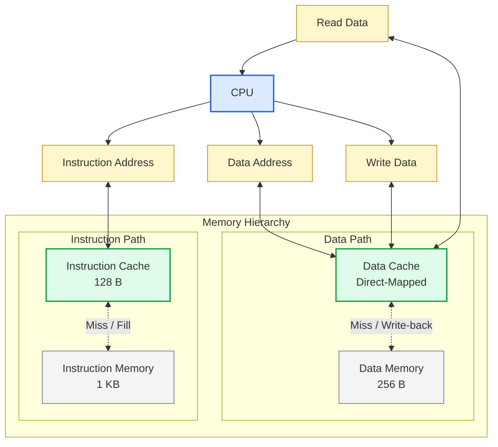

# Memory Hierarchy Reference — 8-bit Processor

## System Overview

From Lab 5 onwards the processor is backed by a two-level memory hierarchy with **separate instruction and data paths**.



---

## Data Memory (Direct Access)

### New Instructions

| Instruction | Addressing Mode | Operation |
|---|---|---|
| `lwd rd rs` | Register direct | `REG[rd] ← Mem[REG[rs]]` |
| `lwi rd imm` | Immediate | `REG[rd] ← Mem[imm]` |
| `swd rt rs` | Register direct | `Mem[REG[rs]] ← REG[rt]` |
| `swi rt imm` | Immediate | `Mem[imm] ← REG[rt]` |

### CPU–Memory Interface

| Signal | Direction | Description |
|---|---|---|
| `ADDRESS [7:0]` | CPU → Memory | Address to read or write |
| `WRITEDATA [7:0]` | CPU → Memory | Data to write (from register file) |
| `READDATA [7:0]` | Memory → CPU | Data read from memory |
| `READ` | CPU → Memory | Asserted to request a read |
| `WRITE` | CPU → Memory | Asserted to request a write |
| `BUSYWAIT` | Memory → CPU | Held high while operation is in progress |

### BUSYWAIT Stall Behaviour

When the data memory (or cache) asserts `BUSYWAIT`:
- The CPU **freezes the PC** (does not increment or write it)
- The CPU **holds `ADDRESS`, `READ`, and `WRITE` stable**
- The CPU **suppresses register file writes**
- Execution resumes on the cycle after `BUSYWAIT` is de-asserted

### Data Memory Parameters

| Parameter | Value |
|---|---|
| Size | 256 × 8-bit (256 bytes) |
| Word size | 1 byte |
| Read/write latency | 5 CPU cycles (`#40` time units) |
| `BUSYWAIT` | Asserted immediately on READ/WRITE, de-asserted after operation |

### Instruction Timing (ideal cache, `#2` memory access)

| Instruction | Critical path |
|---|---|
| `lwd` | PC(#1)→IMEM(#2)→DEC(#1)→RREAD(#2)→ALU(#1)→DMEM(#2)→RWRT(#1) = 10 |
| `lwi` | PC(#1)→IMEM(#2)→DEC(#1)→ALU(#1)→DMEM(#2)→RWRT(#1) = 8 |
| `swd` | PC(#1)→IMEM(#2)→DEC(#1)→RREAD(#2)→ALU(#1)→DMEM(#2) = 9 |
| `swi` | PC(#1)→IMEM(#2)→DEC(#1)→RREAD(#2)→DMEM(#2) = 8 |

> Without a cache, memory accesses take 5 full CPU cycles, stalling the processor each time.

---

## Data Cache

### Cache Architecture

| Parameter | Value |
|---|---|
| Word size | 1 byte |
| Block size | 4 bytes |
| Placement | Direct-mapped |
| Write policy | Write-back |
| Allocation policy | Write-allocate |
| Timescale | `1ns / 100ps` |

### Address Breakdown

Given an 8-bit address and 4-byte blocks:

```
  Bit 7            Bit 0
  ┌──────────┬───────┬──────┐
  │   Tag    │ Index │ Offset│
  └──────────┴───────┴──────┘
```

> Exact bit widths depend on your cache size. For a 16-entry cache: `Tag[7:6] | Index[5:2] | Offset[1:0]`

### Cache Entry Structure

Each cache line stores:
- **Valid bit** — whether the entry holds valid data
- **Dirty bit** — whether the entry has been modified since being fetched
- **Tag** — upper address bits to verify a hit
- **Data block** — 4 bytes of data

### Hit/Miss Detection Timing

```
ADDRESS arrives
    │
    ├─ #1 ──► Index lookup (extract stored tag, valid, dirty, block)
    │              │
    │              ├─ #0.9 ──► Tag compare + valid check → HIT or MISS
    │              │
    └─ #1 ──► Data word select (parallel to tag compare)
```

Total time to determine hit/miss and select data: **#1.9** after ADDRESS is stable.

### Read Hit

1. Tag comparison resolves at `#1.9` → HIT
2. Cache sends the selected data word to CPU asynchronously
3. Cache de-asserts `BUSYWAIT`

Total extra stall: **0 cycles**

### Write Hit

1. Tag comparison resolves at `#1.9` → HIT
2. Cache de-asserts `BUSYWAIT` (CPU can proceed next cycle)
3. At the **next positive clock edge**, cache writes the data word and updates dirty/valid bits (`#1` write latency)

Total extra stall: **0 cycles**

### Read Miss — Clean Block

```
Miss detected
→ Assert MEM_READ
→ Next clock edge: memory starts fetching block (5 cycles × 4 bytes = 20 cycles)
→ Memory de-asserts MEM_BUSYWAIT
→ Cache writes fetched block + updates tag/valid/dirty
→ Asynchronous logic resolves hit after #1.9
→ Cache de-asserts BUSYWAIT
```

Total stall: **21 CPU cycles**

### Read Miss — Dirty Block (Write-Back First)

```
Miss detected
→ Assert MEM_WRITE (write back dirty block)
→ Next clock edge: memory writes dirty block (20 cycles)
→ MEM_BUSYWAIT de-asserted
→ 1-cycle gap
→ Assert MEM_READ
→ Next clock edge: memory fetches new block (20 cycles)
→ Cache updates → hit resolves → BUSYWAIT de-asserted
```

Total stall: **42 CPU cycles**

### Write Miss

Same write-back decision and fetch sequence as a read miss. After the new block is in cache, the original write is served at the next clock edge.

Total stall: **21 cycles** (clean) / **42 cycles** (dirty)

### Miss Handler FSM

The cache controller implements a finite-state machine for miss handling from the positive clock edge after a miss is detected. Suggested states:

| State | Description |
|---|---|
| `IDLE` | Monitoring READ/WRITE from CPU; assert BUSYWAIT on request |
| `MEM_WRITE` | Writing dirty block back to memory; hold MEM_WRITE and block address stable |
| `MEM_READ` | Fetching missing block from memory; hold MEM_READ stable |
| `CACHE_UPDATE` | Writing fetched block into cache entry; update tag, valid, dirty |

---

## Instruction Memory and Cache

### Cache Architecture

| Parameter | Value |
|---|---|
| Cache size | 128 bytes |
| Block size | 16 bytes (4 × 32-bit instructions) |
| Number of entries | 8 |
| Placement | Direct-mapped |
| Write policy | Read-only (no dirty bit; no CPU writes to instruction memory) |
| Timescale | `1ns / 100ps` |

### Address Breakdown

The CPU provides a 10-bit word-aligned PC address (bits [1:0] are always `00`).

```
  Bit 9        Bit 0
  ┌───────┬───────┬────────┐
  │  Tag  │ Index │ Offset │
  └───────┴───────┴────────┘
     [9:6]   [5:4]   [3:2]     (example split for 8-entry, 16B block cache)
```

Bits [1:0] are unused (word-aligned).

### Cache Entry Structure

Each cache line stores:
- **Valid bit** — initially 0 (invalid) for all entries
- **Tag** — to verify a hit
- **Instruction block** — 16 bytes (4 instructions)

No dirty bit is needed because the CPU never writes to the instruction memory.

### Read Hit Timing

Same as data cache:
- Index lookup: `#1`
- Tag compare + validation: `#0.9`
- Instruction word select (parallel to tag compare): `#1`
- Hit resolved at `#1.9`; BUSYWAIT de-asserted

Total extra stall: **0 cycles**

### Miss Handling

```
Miss detected
→ Assert MEM_READ immediately
→ Next clock edge: instruction memory starts fetching 16-byte block
   (16 bytes × 5 cycles/byte = 80 cycles)
→ MEM_BUSYWAIT de-asserted
→ Same clock edge: write fetched block into cache, update tag + valid (#1)
→ Asynchronous logic re-evaluates: hit after #1.9
→ BUSYWAIT de-asserted at next positive clock edge
```

Total stall: **81 CPU cycles**

### Instruction Memory Parameters

| Parameter | Value |
|---|---|
| Size | 1024 bytes (256 × 32-bit words) |
| Block interface | 6-bit block address, 128-bit (16-byte) data output |
| Read latency | 80 CPU cycles (`#640` time units for a full block) |

---

## Performance Comparison:

| Metric | No cache | Data cache | Data & Instr cache |
|---|---|---|---|
| Data access — hit | 5 cycles stall | 0 cycles stall | 0 cycles stall |
| Data access — clean miss | 5 cycles stall | 21 cycles stall | 21 cycles stall |
| Data access — dirty miss | 5 cycles stall | 42 cycles stall | 42 cycles stall |
| Instr fetch — hit | `#2` (hardcoded array) | `#2` | 0 cycles stall |
| Instr fetch — miss | N/A | N/A | 81 cycles stall |


---

## Timescale Note

All modules include:

```verilog
`timescale 1ns/100ps
```

This enables simulation of fractional delays such as `#0.9`. Thus every Verilog file in the design uses the same timescale directive, o yield correct simulation results.
